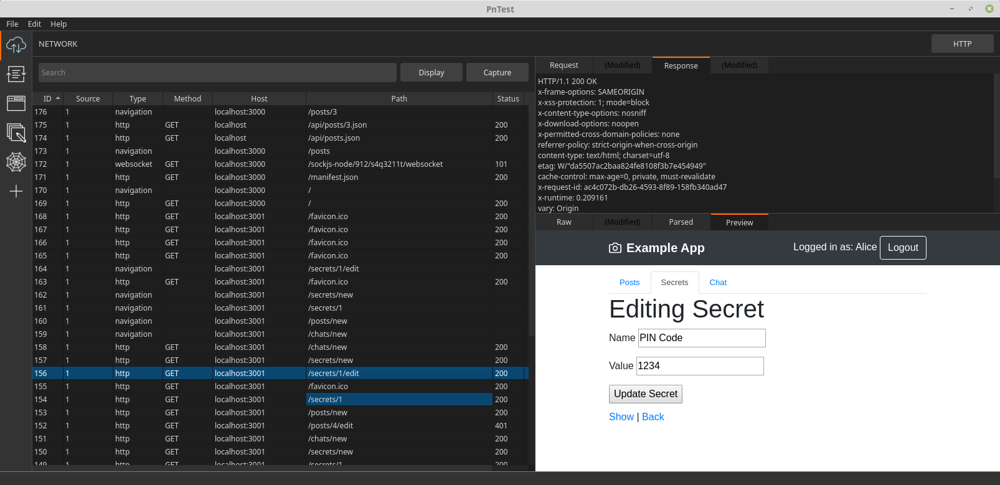

# PnTest

An HTTP (and Websockets) proxy for performing penetration tests against web applications, with advanced capabilities for handling single-page-applications. This repo contains the frontend GUI application based on Python 3.9 and PySide2.



## Key Features

- Detects which browsers you have installed and launches it pre-configured for PnTest to intercept HTTPS requests
- Open multiple instances of the same browser in isolated-environments so you can keep multiple sessions active at the same time
- Uses the browser's API to grab the rendered HTML allowing you to view what you actually see in the browser
- Crawl SPAs (i.e. React sites) as well as traditional web applications
- Intercept and modify requests and responses

## Install
```bash
$ git clone git@github.com:evanrolfe/pntest.git
$ cd pntest
$ virtualenv -p /usr/bin/python3.9 venv
$ source venv/bin/activate
$ pip install -r requirements.txt
```

## Develop
Always run `source venv/bin/activate` at the start to load the Python virtual env.

Run the app in developer mode:
```bash
$ bin/dev
```

Compile Qt UI files to python with: (requires pyqt6rc which should be installed outside of the venv because of version conflicts)
```bash
$ bin/compile_views
```

Run the linter with `flake8`.

## Test
Run the test suite with:
```
$ bin/test
```

## Build
First build the proxy, copy it to include, then build the final binary:
```
$ bin/build_proxy
$ mv dist/pntest_proxy include/pntest_proxy
$ bin/build
```
Which outputs a binary to `dist/pntest/`.

## Notes
Icons come from:
https://icons8.com/icon/set/console/dusk
https://www.flaticon.com/search?word=terminal

To get `bin/build` to work you need to change `venv/lib/python3.9/site-packages/_pyinstaller_hooks_contrib/hooks/stdhooks/hook-pendulum.py` from:
```python
datas = collect_data_files("pendulum.locales", include_py_files=True)
hiddenimports = collect_submodules("pendulum.locales")

```
to this:
```python
datas = collect_data_files("pendulum", include_py_files=True)
hiddenimports = collect_submodules("pendulum")
```

## Generating certificate authority and importing to browsers:
*Certificate authority*
1. Generate the CA key:
```
$ openssl genrsa -des3 -out include/rootCA.key 4096
```
2. Generate a cert and pem file
```
$ openssl req -x509 -new -nodes -extensions v3_ca -key include/rootCA.key -sha256 -days 3650 -out include/mitmproxy-ca.pem
$ openssl rsa -in include/rootCA.key >> include/mitmproxy-ca.pem
```

*Import to browsers*
[Chrome/Chromium] No more action needed as chrome is started using the `--ignore-certificate-errors-spki-list` option.

[Firefox] Generate the cert9.db file with the certificate imported:

1. Create a new firefox profile:
```
$ firefox -CreateProfile pntest-new
```

2. Start firefox:
```
$ firefox -P "pntest-cert"
```

3. Import the certiciate (settins -> certificates -> import -> select include/mitmproxy-ca.pem -> Trust CA to identify web sites & Trust CA to identify email users)

4. Locate the cert9.db file i.e. `~/.mozilla/firefox/gwmyug3m.pntest-cert/cert9.db` in Linux and copy it to `pntest/include/cert9.db`
